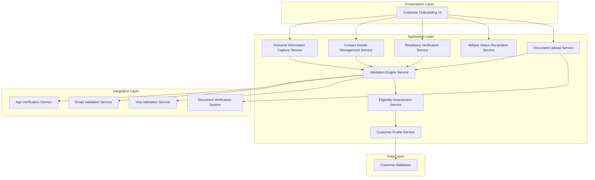
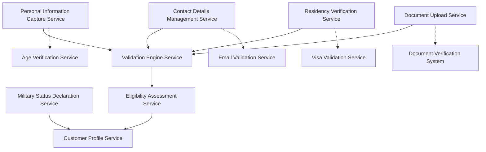
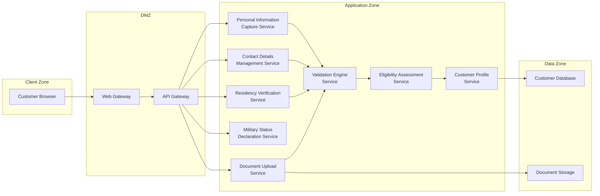
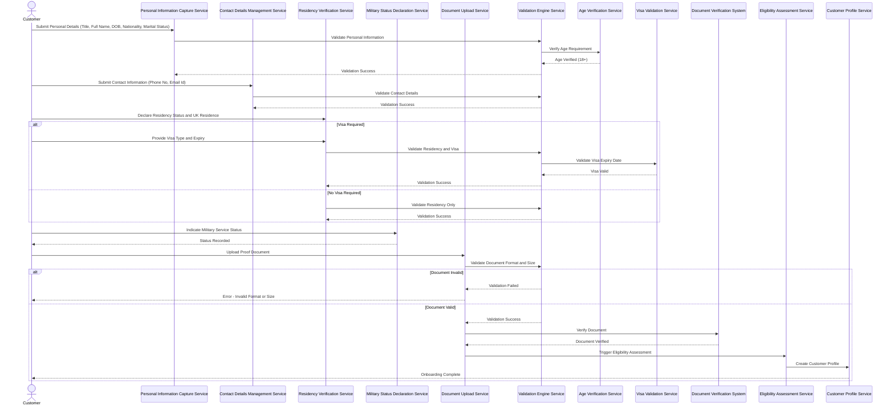

```mermaid
%% TITLE: System Architecture
graph TD
    subgraph Presentation_Layer["Presentation Layer"]
        UI["Customer Onboarding UI"]
    end
    
    subgraph Application_Layer["Application Layer"]
        PICS["Personal Information Capture Service"]
        CDMS["Contact Details Management Service"]
        RVS["Residency Verification Service"]
        MSDS["Military Status Declaration Service"]
        DUS["Document Upload Service"]
        VES["Validation Engine Service"]
        EAS["Eligibility Assessment Service"]
        CPS["Customer Profile Service"]
    end
    
    subgraph Integration_Layer["Integration Layer"]
        AVS["Age Verification Service"]
        DVS["Document Verification System"]
        VVS["Visa Validation Service"]
        EVS["Email Validation Service"]
    end
    
    subgraph Data_Layer["Data Layer"]
        DB["Customer Database"]
    end
    
    UI --> PICS
    UI --> CDMS
    UI --> RVS
    UI --> MSDS
    UI --> DUS
    
    PICS --> VES
    CDMS --> VES
    RVS --> VES
    DUS --> VES
    
    VES --> AVS
    VES --> EVS
    VES --> VVS
    DUS --> DVS
    
    VES --> EAS
    EAS --> CPS
    CPS --> DB
```

```mermaid
%% TITLE: Component Diagram
graph TD
    PICS["Personal Information Capture Service"]
    CDMS["Contact Details Management Service"]
    RVS["Residency Verification Service"]
    MSDS["Military Status Declaration Service"]
    DUS["Document Upload Service"]
    VES["Validation Engine Service"]
    EAS["Eligibility Assessment Service"]
    CPS["Customer Profile Service"]
    AVS["Age Verification Service"]
    DVS["Document Verification System"]
    VVS["Visa Validation Service"]
    EVS["Email Validation Service"]
    
    PICS --> VES
    PICS -.-> AVS
    
    CDMS --> VES
    CDMS -.-> EVS
    
    RVS --> VES
    RVS -.-> VVS
    
    MSDS --> CPS
    
    DUS --> VES
    DUS -.-> DVS
    
    VES --> EAS
    EAS --> CPS
```

```mermaid
%% TITLE: Business Process Flow
graph TD
    Start["Customer Begins Onboarding"]
    
    Start --> CapturePersonal["Capture Personal Details:<br/>Title, Full Name, DOB,<br/>Nationality, Marital Status"]
    
    CapturePersonal --> ValidatePersonal{"Validate Personal Info:<br/>Completeness & Age 18+"}
    
    ValidatePersonal -->|Invalid| CapturePersonal
    ValidatePersonal -->|Valid| CaptureContact["Submit Contact Information:<br/>Phone No, Email Id"]
    
    CaptureContact --> ValidateContact{"Validate Contact Details:<br/>Correct Format"}
    
    ValidateContact -->|Invalid| CaptureContact
    ValidateContact -->|Valid| DeclareResidency["Declare Residency Status<br/>and UK Residence Info"]
    
    DeclareResidency --> CheckVisa{"Visa Required?"}
    
    CheckVisa -->|Yes| ProvideVisa["Provide Visa Type<br/>and Expiry Date"]
    CheckVisa -->|No| ValidateResidency{"Validate Residency<br/>Information"}
    
    ProvideVisa --> ValidateResidency
    
    ValidateResidency -->|Invalid| DeclareResidency
    ValidateResidency -->|Valid| IndicateMilitary["Indicate Military Service<br/>or Veteran Status"]
    
    IndicateMilitary --> UploadDocument["Upload Proof Document<br/>for Identity Verification"]
    
    UploadDocument --> ValidateDocument{"Validate Document:<br/>Format & File Size"}
    
    ValidateDocument -->|Invalid| UploadDocument
    ValidateDocument -->|Valid| Complete["Complete Onboarding Process"]
```

```mermaid
%% TITLE: Network & Deployment Architecture
graph LR
    subgraph Client_Zone["Client Zone"]
        Browser["Customer Browser"]
    end
    
    subgraph DMZ["DMZ"]
        WebGW["Web Gateway"]
        APIGW["API Gateway"]
    end
    
    subgraph Application_Zone["Application Zone"]
        PICS["Personal Information<br/>Capture Service"]
        CDMS["Contact Details<br/>Management Service"]
        RVS["Residency Verification<br/>Service"]
        MSDS["Military Status<br/>Declaration Service"]
        DUS["Document Upload<br/>Service"]
        VES["Validation Engine<br/>Service"]
        EAS["Eligibility Assessment<br/>Service"]
        CPS["Customer Profile<br/>Service"]
    end
    
    subgraph Data_Zone["Data Zone"]
        DB["Customer Database"]
        DocStore["Document Storage"]
    end
    
    Browser --> WebGW
    WebGW --> APIGW
    
    APIGW --> PICS
    APIGW --> CDMS
    APIGW --> RVS
    APIGW --> MSDS
    APIGW --> DUS
    
    PICS --> VES
    CDMS --> VES
    RVS --> VES
    DUS --> VES
    
    VES --> EAS
    EAS --> CPS
    
    CPS --> DB
    DUS --> DocStore
```

```mermaid
%% TITLE: Sequence Diagram
sequenceDiagram
    actor Customer
    participant PICS as Personal Information Capture Service
    participant CDMS as Contact Details Management Service
    participant RVS as Residency Verification Service
    participant MSDS as Military Status Declaration Service
    participant DUS as Document Upload Service
    participant VES as Validation Engine Service
    participant AVS as Age Verification Service
    participant VVS as Visa Validation Service
    participant DVS as Document Verification System
    participant EAS as Eligibility Assessment Service
    participant CPS as Customer Profile Service
    
    Customer->>PICS: Submit Personal Details (Title, Full Name, DOB, Nationality, Marital Status)
    PICS->>VES: Validate Personal Information
    VES->>AVS: Verify Age Requirement
    AVS-->>VES: Age Verified (18+)
    VES-->>PICS: Validation Success
    
    Customer->>CDMS: Submit Contact Information (Phone No, Email Id)
    CDMS->>VES: Validate Contact Details
    VES-->>CDMS: Validation Success
    
    Customer->>RVS: Declare Residency Status and UK Residence
    
    alt Visa Required
        Customer->>RVS: Provide Visa Type and Expiry
        RVS->>VES: Validate Residency and Visa
        VES->>VVS: Validate Visa Expiry Date
        VVS-->>VES: Visa Valid
        VES-->>RVS: Validation Success
    else No Visa Required
        RVS->>VES: Validate Residency Only
        VES-->>RVS: Validation Success
    end
    
    Customer->>MSDS: Indicate Military Service Status
    MSDS-->>Customer: Status Recorded
    
    Customer->>DUS: Upload Proof Document
    DUS->>VES: Validate Document Format and Size
    
    alt Document Invalid
        VES-->>DUS: Validation Failed
        DUS-->>Customer: Error - Invalid Format or Size
    else Document Valid
        VES-->>DUS: Validation Success
        DUS->>DVS: Verify Document
        DVS-->>DUS: Document Verified
        DUS->>EAS: Trigger Eligibility Assessment
        EAS->>CPS: Create Customer Profile
        CPS-->>Customer: Onboarding Complete
    end
```